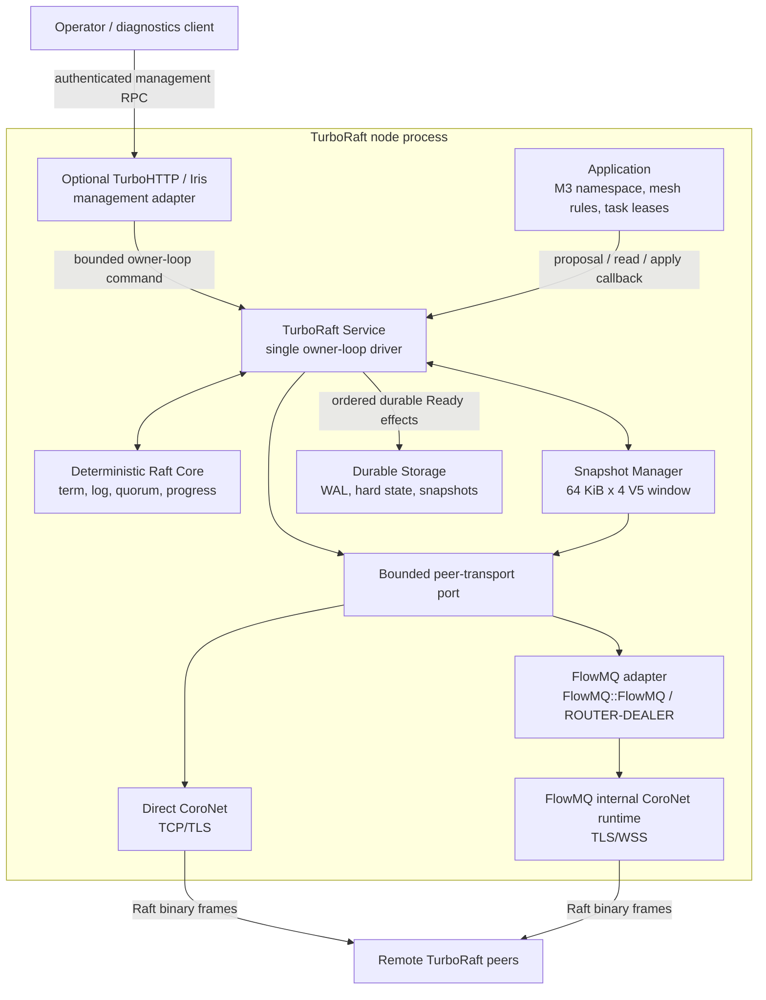
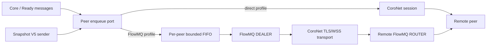

# TurboRaft Architecture Design

Status: implemented architecture; production hardening remains in progress.

## 1. Decision summary

TurboRaft is a layered replicated-state-machine library. Consensus safety belongs to a deterministic core. Network, persistence, application state, and HTTP administration are ports around that core.



The peer protocol is not JSON-RPC. Consensus traffic uses the same bounded
binary wire protocol through either direct CoroNet TCP/TLS or the optional
FlowMQ `ROUTER`/`DEALER` adapter over TLS/WSS. TurboHTTP/Iris is limited to
authenticated operator and diagnostic APIs.

## 2. Evidence and constraints

| Level | Evidence | Design consequence |
|---|---|---|
| HIGH | Fact: Raft safety requires durable term, vote, and log state before messages that depend on that state are sent. | The driver exposes an ordered `Ready` batch and never lets transport outrun persistence. |
| HIGH | Fact: CoroNet sockets, listeners, timeouts, sleeps, and managed coroutines are context-owned. | One CoroNet context owns one or more Raft groups; all mutable group state stays on its owner loop. |
| HIGH | Fact: TurboUtils provides `pread`, `pwrite`, `ftruncate`, `fsync`, and atomic same-filesystem rename. | WAL and snapshot storage use TurboUtils rather than a second cross-platform file layer. |
| HIGH | Fact: TurboUtils does not currently expose parent-directory fsync in its public file API. | Strict snapshot publication needs a small platform durability port. Failure to sync the directory is reported, not silently ignored. |
| MED | Fact: Iris provides JSON-RPC method registration and request limits. | Administration can use TurboHTTP, but handlers must enqueue bounded owner-loop commands rather than mutate Raft state directly. |
| MED | Inference: a pure deterministic core is easier to simulate, model-check, and fuzz than an I/O-coupled core. | Time is represented as explicit ticks and network delivery as explicit messages. |

## 3. Scope

### In scope

- Leader election, including pre-vote.
- Log replication and conflict optimization.
- Durable hard state and segmented WAL.
- Static three-node and five-node clusters.
- Deterministic application callbacks.
- Safe linearizable reads using `ReadIndex`.
- Snapshots and log compaction.
- Learners and joint-consensus membership changes.
- Leadership transfer and check-quorum.
- Direct CoroNet TCP/TLS peer transport.
- Optional FlowMQ `ROUTER`/`DEALER` peer transport over TLS/WSS.
- Optional TurboHTTP JSON-RPC management adapter.
- Metrics, structured diagnostics, and audit events for membership changes.

### Out of scope

- Byzantine fault tolerance.
- WAN federation between independent Raft groups.
- File chunks, M3 objects, or bulk mesh payloads in the Raft log.
- Transparent exactly-once external side effects.
- Lease-based reads in the first production version.
- Automatic unsafe recovery from a lost majority.

## 4. Core implementation decision gate

Implementation must not begin by casually rewriting Raft. Phase 0 compares the following candidates against ABI, license, Windows, deterministic testing, and CoroNet integration requirements.

| Candidate | Advantages | Problems | Decision |
|---|---|---|---|
| `willemt/raft` | BSD-3-Clause, pure C, no network dependency, simulator and property-based tests, callback ports for persistence and transport. | Persistence callbacks synchronously flush before return; linearizable reads are still listed as roadmap; snapshot transfer is external; batching, pre-vote, check-quorum, and membership semantics require audit or extension. | First candidate for an audited bootstrap core, not a drop-in production dependency. |
| `cowsql/raft` | Production-grade asynchronous C core, mature tests, explicit I/O abstraction. | Modified LGPLv3 requires project license approval; upstream build and I/O assumptions need an adapter spike. | Preferred technical candidate if license and adapter review pass. |
| `NuRaft` | Apache-2.0, feature rich, maintained. | C++ and ASIO introduce a second event system; Windows TLS support is limited upstream. | Reject for the default architecture. |
| Native TurboRaft core | Exact C ABI and deterministic `Ready` model. | Highest correctness and schedule risk; requires differential tests and model checking before production. | Use only if reusable-core licensing or integration fails. |

The Phase 0 order is `willemt/raft` audit, `cowsql/raft` license and adapter audit, then native core only if both fail. `willemt/raft` is selected only if the gap-closing work can preserve its tested invariants while adding an asynchronous durable-effect boundary. The selected core is hidden behind TurboRaft's public C ABI. No upstream type crosses the public boundary. Vendored code, if selected, records the upstream version, license, source URL, and local patch set.

The detailed adoption criteria are defined in [WILLEMT_RAFT_ASSESSMENT.md](WILLEMT_RAFT_ASSESSMENT.md).

## 5. Modules and targets

| CMake target | Responsibility | Required dependencies |
|---|---|---|
| `TurboRaft::Core` | Deterministic Raft state machine, quorum math, progress tracking, message production. | TurboUtils Core only for bounded containers and errors. |
| `TurboRaft::Storage` | WAL, hard state, snapshots, recovery, corruption detection. | `TurboUtils::Core`, CRC32C provider. |
| `TurboRaft::CoroNet` | Peer listener, outbound pools, framing, TLS identity, backpressure. | `TurboNet::CoroNet`. |
| `TurboRaft::FlowMQ` | Optional ROUTER/DEALER peer service, secure endpoint validation, batching, retained snapshot buffers. | Core, CoroNet, and the public `FlowMQ::FlowMQ` target. |
| `TurboRaft::Service` | Owner-loop driver, `Ready` ordering, proposal/read completion, lifecycle. | Core, Storage, CoroNet. |
| `TurboRaft::HTTP` | Optional Iris JSON-RPC administration and diagnostics. | Service, TurboHTTP Iris/RPC. |

The public ABI is C11. C++ may exist in private linkage shims only when a dependency requires it.

## 6. Ownership and thread model

- A `tr_service_t` and its `tr_node_t` have exactly one mutable owner: the CoroNet context thread.
- Network receive coroutines decode bounded frames and post immutable owned messages to the owner loop.
- Storage work runs on a dedicated single-writer worker per storage directory.
- Storage completions return to the owner loop in submission order.
- Application apply runs on the owner loop by default because command order is part of the contract.
- An application may request an external apply executor only if it preserves strict index order and completion acknowledgement.
- TurboHTTP handlers submit commands through a bounded mailbox and complete asynchronously.
- Callbacks never run while an internal mutex is held.
- Shutdown first rejects new proposals, then stops peer admission, drains or cancels bounded work, persists acknowledged state, closes sockets, and destroys the context-owned service.

No lock-free queue is required by the design. The initial implementation uses the simplest bounded mailbox compatible with actual producer and consumer cardinality.

## 7. Deterministic core contract

The core consumes explicit inputs and emits an ordered batch of effects. It performs no I/O, reads no wall clock, allocates no unbounded storage, and invokes no user callback.

```c
typedef struct tr_node_s tr_node_t;
typedef struct tr_ready_s tr_ready_t;

int tr_node_tick(tr_node_t *node);
int tr_node_step(tr_node_t *node, const tr_message_t *message);
int tr_node_propose(tr_node_t *node, const tr_proposal_t *proposal);
int tr_node_read_index(tr_node_t *node, const tr_read_request_t *request);
int tr_node_ready(tr_node_t *node, const tr_ready_t **ready_out);
int tr_node_advance(tr_node_t *node, const tr_advance_t *advance);
```

The API sketch is not frozen. Its invariants are frozen:

- `tr_node_ready()` returns a borrowed immutable view valid until `tr_node_advance()`.
- At most one unadvanced ready batch exists per node.
- A failed input does not partially mutate visible core state.
- Every emitted message and entry has configured count and byte limits.
- The same initial state and ordered inputs produce the same outputs.
- Proposal acceptance does not mean commitment.
- A completion is reported only after commitment and ordered application.

## 8. Ready processing protocol

The service processes each ready batch in this order:

1. Validate all size arithmetic and capacity limits.
2. Encode entries, hard state, and snapshot metadata into one storage batch.
3. Persist entries and hard state and complete the required `fsync`.
4. Mark the batch durable on the owner loop.
5. Send peer messages whose safety depends on the durable batch.
6. Publish committed entries to the application in index order.
7. Persist or otherwise atomically track application `last_applied` according to the state-machine contract.
8. Advance the core only after the batch reaches its documented terminal state.

Outbound messages may be prepared while storage is running, but may not become visible to the transport before step 4. A storage failure transitions the service to `FAULTED`; it does not continue with volatile state.

## 9. Storage ownership and recovery

Each storage directory belongs to one node identity and is protected by an exclusive process lock.

```text
data/
  identity
  wal/
    0000000000000001-0000000000000001.trwal
  snapshots/
    0000000000000042-0000000000000100.trsnap
  CURRENT
```

The WAL is segmented and append-only except for conflict truncation and compaction. Records contain a version, record type, term, index, payload length, and CRC32C. Lengths are checked before allocation.

Recovery rules:

- An incomplete final record caused by a torn append is truncated to the previous valid boundary.
- A checksum or structural error before the final record is corruption and fails startup.
- Missing entries between snapshot index and WAL first index fail startup.
- Hard state cannot reference a term or commit index unavailable from the recovered snapshot and WAL.
- Node and cluster UUIDs in storage must match configuration.
- The node never generates a replacement identity when valid storage already exists.

Snapshot publication writes a private temporary file, syncs it, atomically renames it, and syncs the parent directory. Windows and POSIX durability details remain behind `tr_durability_port_t`.

## 10. State-machine contract

```c
typedef struct {
  void *user_data;
  int (*apply)(void *user_data, uint64_t index, uint64_t term,
               const void *command, size_t command_size,
               tr_apply_result_t *result);
  int (*snapshot_write)(void *user_data, tr_snapshot_writer_t *writer,
                        uint64_t last_index, uint64_t last_term);
  int (*snapshot_restore)(void *user_data, tr_snapshot_reader_t *reader,
                          uint64_t last_index, uint64_t last_term);
} tr_state_machine_v1_t;
```

Commands must be deterministic. A callback must not derive replicated state from local time, random bytes, network calls, mutable environment variables, or filesystem enumeration.

Raft does not make external effects exactly once. Mesh task execution must apply a committed intent and fencing token to replicated state, then let an executor perform the effect idempotently. A stale executor must be rejected by downstream fencing checks.

## 11. Identity, addressing, and mesh integration

- `cluster_id` and `node_id` are stable non-zero UUIDs generated with TurboUtils secure UUID APIs.
- A removed node ID is never reused.
- IP addresses, ports, virtual IPs, and DNS names are mutable endpoints, not identities.
- Peer endpoint changes are replicated metadata and become active only through committed configuration.
- The mesh may resolve a virtual address to a real route locally, but the authenticated peer certificate must still bind the stable node identity.
- M3 stores only namespace metadata and manifest references in Raft. Chunks remain content-addressed P2P data.

## 12. Reads and client semantics

- MVP writes are accepted by the leader; followers return a typed leader hint or `TR_ENOTLEADER`.
- MVP linearizable reads use quorum-confirmed `ReadIndex`.
- A read executes only when `last_applied >= read_index`.
- Serializable local reads are a separate explicit API and never masquerade as linearizable.
- Lease reads remain disabled until monotonic-clock, pause, and drift assumptions have dedicated tests.
- Client retries may duplicate proposals. Applications requiring deduplication replicate a client session and monotonically increasing request sequence in their state machine.

## 13. Membership changes

Static membership ships first. Dynamic membership is enabled only when the complete protocol is implemented and tested.

- New servers join as non-voting learners.
- Promotion requires the learner to catch up to a configurable lag threshold.
- Voter changes use joint consensus.
- Only one unresolved configuration transition may exist at a time.
- Removing the current leader requires leadership transfer or an explicit operator override.
- Two-voter production clusters are rejected by default because one failure removes quorum.
- Forced quorum reconstruction is an offline disaster-recovery tool, not an RPC method.

## 14. Peer transport

The service and snapshot manager depend on one payload-enqueue port. The wire
codec, HELLO/ACK negotiation, peer identity, cumulative acknowledgements, and
Raft progress remain transport-neutral.

FlowMQ is provided by the independent `flowmq` repository. Its only public
consumer target is `FlowMQ::FlowMQ`; protocol, runtime, and transport details
remain private to that package.

The installed FlowMQ API exposes standalone CONNECT and ROUTER/BIND owners.
TurboRaft embeds their public configuration types, installs private callbacks,
and links only `FlowMQ::FlowMQ`; it does not include FlowMQ private runtime
headers or depend on TurboFlow.



- Direct CoroNet uses one persistent TCP/TLS stream per directed peer
  relationship. Plaintext TCP is development-only and requires an explicit
  option.
- FlowMQ maps one local node to one `ROUTER` listener and one `DEALER` per
  configured remote peer. Only TLS and WSS endpoints are accepted.
- Both adapters reuse the bounded Raft wire codec and negotiated Snapshot V4/V5
  profile. A negotiated-profile mismatch fails at the transport boundary.
- Frames and decoded messages are bounded before allocation. Snapshot V5 uses
  64 KiB chunks, a four-slot sender window, cumulative ACK, and at most 256 KiB
  of retained snapshot bytes per peer.
- FlowMQ copies a borrowed snapshot chunk once into an owned `mem_buffer_t`
  before it crosses the asynchronous queue boundary. Queue saturation returns
  `TURBO_ENOSPC`; it never silently drops or grows without bound.
- Duplicate direct connections are resolved deterministically using stable
  node IDs. FlowMQ requires mutual TLS/WSS for this adapter. The DEALER identity
  selects a configured peer, and the following Raft HELLO must carry the
  expected cluster and node ID before a session is admitted.
- Connection failure affects availability, not core safety; retry and resume
  begin from Raft progress and the last cumulative snapshot ACK.

The detailed FlowMQ topology and lifecycle are documented in
[FLOWMQ_PEER_TRANSPORT.md](FLOWMQ_PEER_TRANSPORT.md); the bounded replication
protocol is documented in
[HIGH_PERFORMANCE_REPLICATION.md](HIGH_PERFORMANCE_REPLICATION.md).

TurboFlow integration belongs above both libraries: a product composition
module may call `tr_raft_service_propose()` and consume committed entries via
`apply_batch()`. Neither TurboFlow nor TurboRaft needs access to FlowMQ's
private targets; the composition links only the public library targets it uses.

## 15. TurboHTTP management plane

The HTTP adapter exposes observation by default and mutations only with authentication, authorization, and audit logging.

Proposed read methods:

- `raft.status`
- `raft.members`
- `raft.progress`
- `raft.storage.status`
- `raft.read_index`

Proposed mutation methods:

- `raft.member.add_learner`
- `raft.member.promote`
- `raft.member.remove`
- `raft.leader.transfer`
- `raft.snapshot.trigger`

The adapter does not expose `AppendEntries`, `RequestVote`, raw WAL writes, force-commit, term changes, or arbitrary state mutation. Request bodies, batch sizes, response sizes, authentication failures, and pending requests are bounded.

## 16. Configuration

Configuration precedence is command line, environment, TOML, then defaults. Validation occurs before opening storage or sockets.

Required configuration includes:

- Stable cluster and node UUIDs.
- Absolute storage directory.
- Peer listen endpoint and advertised virtual endpoint.
- TLS certificate, private key reference, and trust roots for production.
- Heartbeat interval and randomized election range.
- Entry, append batch, inflight, pending proposal, WAL segment, and snapshot limits.
- Storage sync policy. Production permits only `always`; benchmark-only relaxed modes require a separate build or explicit unsafe flag.

Timing configuration must satisfy a documented inequality. Initial guidance is `election_min >= max(5 * heartbeat, 5 * measured_p99_peer_round_trip_plus_fsync)`, with `election_max > election_min`. This is an operational inference and must be tuned from measured deployment latency, not treated as a safety proof.

## 17. Error and lifecycle semantics

TurboRaft reserves a custom TurboUtils error domain. Public functions return `0` on success and a stable negative error on failure.

Service states are:

```text
NEW -> RECOVERING -> FOLLOWER/CANDIDATE/LEADER -> STOPPING -> STOPPED
                         |
                         +-> FAULTED
```

`FAULTED` rejects proposals and linearizable reads. Disk corruption, fsync failure, invalid recovered state, identity mismatch, and deterministic apply failure are fatal to the local service. They are not retried as if they were transient network errors.

## 18. Security

- Production peer transport requires mutual TLS.
- Certificates bind cluster ID and node ID; endpoint DNS/IP is not the authorization identity.
- Protocol downgrade is rejected after version negotiation.
- Snapshot and append payload sizes are checked before allocation and before decompression.
- Private keys and command payloads are never written to ordinary logs.
- Membership and leadership operations produce audit events with actor, request ID, old state, new state, term, and index.
- The threat model is crash fault tolerance, not Byzantine peers. An authenticated malicious voter is outside Raft's safety model.

## 19. Observability

Metrics include current term, role, leader ID, commit index, applied index, WAL durable index, proposal backlog, read backlog, per-peer match/next index, inflight bytes, snapshot progress, fsync latency, elections, rejected frames, and apply failures.

INFO logs record lifecycle milestones and leadership changes. Repeated heartbeats and append successes are metrics or sampled DEBUG events. Each consumed error is logged once at the service boundary with node, term, index, operation, and error code.

## 20. Build and dependency policy

- CMake minimum version follows the TurboNet baseline.
- Presets are derived from TurboNet's Windows/Linux Ninja and vcpkg presets but copied into this repository for portability.
- `find_package(TurboUtils CONFIG REQUIRED)` and `find_package(TurboNet CONFIG REQUIRED)` consume installed packages.
- `find_package(TurboHttp CONFIG)` enables the optional control plane and console
  when the installed package is available. Server code links `TurboHttp::Iris`;
  client code links the installed facade target `TurboHttp::TurboHttp`.
- A vcpkg manifest pins only direct third-party dependencies, initially the selected CRC32C implementation and test-only fault/fuzz tools if needed.
- Lemon is not used for binary Raft messages. It may be introduced later for a real text grammar, but not for TOML or fixed binary framing.
- No dependency type, error code, or ownership convention crosses the stable public ABI.

## 21. Compatibility and migration

- Wire, WAL, and snapshot formats each have independent versions.
- Unknown major versions fail before mutation.
- Compatible minor fields are length-delimited and skippable.
- A rolling upgrade matrix must prove old/new peer interoperability before a format version is declared stable.
- WAL migration is offline and copy-on-write; in-place destructive migration is prohibited.
- The M3 resolver can replace its local namespace adapter with a Raft-backed adapter without changing object manifests or P2P chunk transfer.
