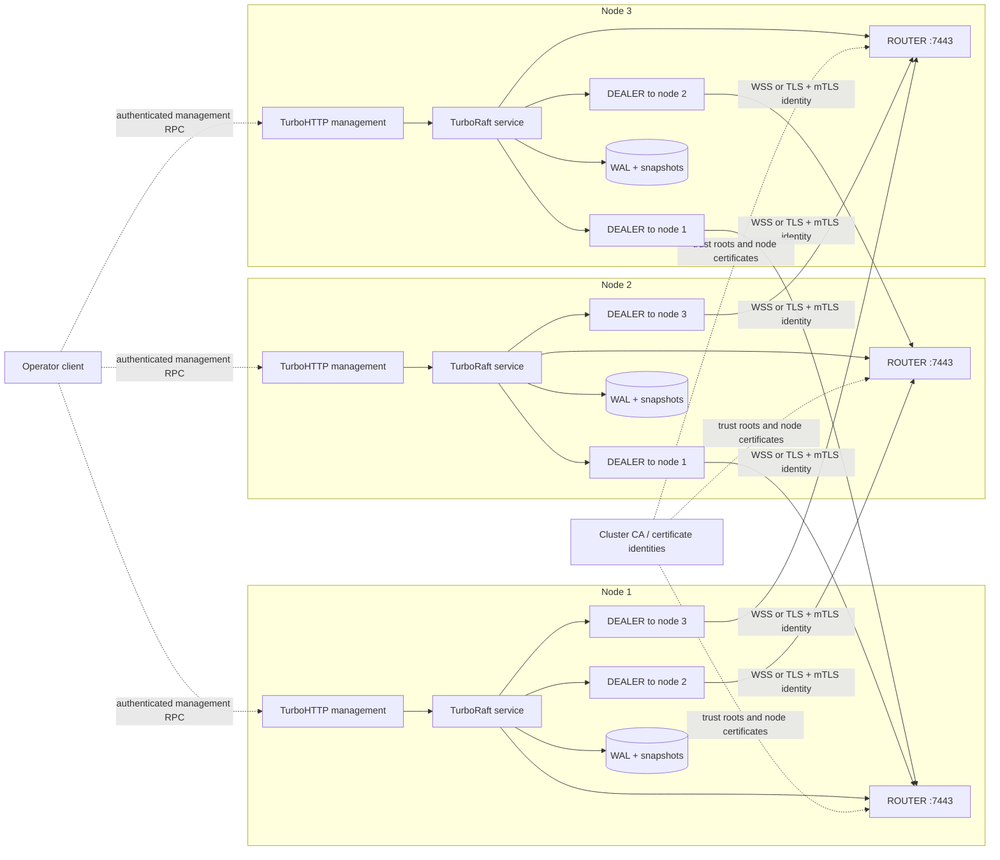
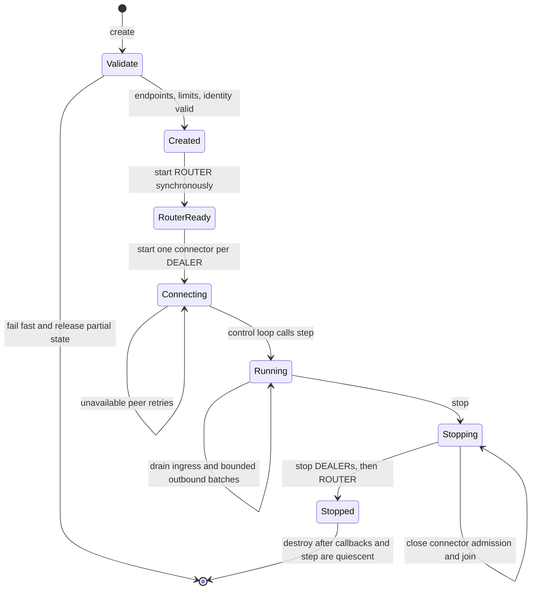

# FlowMQ peer transport

FlowMQ is provided by the independent `C:/projects/cpp/turbonet/flowmq`
repository. It exports one public consumer target, `FlowMQ::FlowMQ`.
TurboRaft consumes that target through `TurboRaft::FlowMQ`; it does not depend
on or name FlowMQ's private protocol, core, or transport targets.

The adapter uses FlowMQ's public CONNECT and ROUTER/BIND endpoint owners. It
does not depend on TurboFlow, RulesForge, or FlowMQ private targets and headers.

The adapter maps one Raft node to one FlowMQ `ROUTER` listener and one `DEALER`
connection for every configured remote peer. It reuses the existing Raft wire
codec and HELLO/ACK negotiation; FlowMQ replaces only the byte transport and
connection routing layer.

## Pattern choice

`ROUTER`/`DEALER` is the peer-replication pattern: it preserves an exact
authenticated peer identity, supports a node with multiple remote peers, and
lets TurboRaft retain each peer's Raft frames until that peer can accept them.

`PUB`/`SUB` is suitable only for derived, non-authoritative fan-out such as
metrics or cluster notifications. It does not provide the per-peer delivery,
acknowledgement, ordering, or backpressure boundary required by AppendEntries
and snapshot transfer. `PAIR` is limited to one fixed counterpart, so it may be
useful for a test harness but does not model a Raft node's multi-peer topology.
Neither pattern is accepted by this replication adapter.

## Three-node deployment

Each process binds exactly one secure `ROUTER`. It creates one outbound
`DEALER` for every other configured Raft node, producing two authenticated
directed connections for each node pair. The HTTP management endpoint and
persistent volume are local to the node and are not part of peer replication.



Deployment invariants:

- `cluster_id` is identical on all nodes; every `node_id` is stable, non-zero,
  unique, and bound to its certificate identity.
- Each node has an independent persistent storage directory. WAL or snapshot
  directories are never shared between processes.
- Every advertised peer endpoint resolves to that peer's `ROUTER`; WSS is
  selected explicitly with `FLOWMQ_TRANSPORT_WSS`.
- Production uses mutual certificate verification. The Raft HELLO then checks
  that the claimed DEALER maps to the configured cluster and node ID.
- Firewalls admit peer TLS/WSS only between cluster nodes; management endpoints
  use a separate authenticated policy.

## Transport and security boundary

Only `FLOWMQ_TRANSPORT_TLS` and `FLOWMQ_TRANSPORT_WSS` are accepted. Host, port,
and WSS path are separate typed fields; there is no fallback to TCP or
plaintext WebSocket.

The adapter requires mutual TLS: ROUTER requires a CA and client certificate;
DEALER requires a CA, client certificate/key, server name, and peer
verification. FlowMQ identity selects the configured peer, while TurboRaft's
HELLO/ACK verifies the expected cluster and node ID before creating the Raft
session.

## Ownership and concurrency

The service owns all FlowMQ endpoints and their private CoroNet contexts.
Endpoint configuration strings and TLS strings are copied by FlowMQ create;
callback and context fields are reserved for TurboRaft and must be zero.

The control thread is the sole caller of lifecycle, enqueue, `step`, and status
operations. Each FlowMQ endpoint may invoke ingress on a different I/O context.
Those producers are serialized into one bounded byte ring; `step` is its only
consumer and is also the only place that invokes Raft message or snapshot
callbacks. FlowMQ callback/context fields are reserved for this adapter.

Each remote peer has a bounded outbound FIFO. Queue saturation returns
`TURBO_ENOSPC`; disconnected peers retain queued messages and are reported as
blocked by `step`. Inbound-ring saturation is fatal because losing an
authentication, handshake, or Raft frame would invalidate protocol ordering.

Snapshot chunk structs carry borrowed data views. Enqueue copies those bytes
once into a retained TurboUtils buffer, so a 64 KiB V5 chunk remains valid
across asynchronous FlowMQ submission without inflating ordinary Raft queue
items. Retained snapshot bytes have an independent 256 KiB per-peer ceiling;
reaching it returns `TURBO_ENOSPC` even when generic queue slots remain.

`max_send_batch_items` bounds how many queued payloads one peer may submit in
one `step`; zero keeps the compatibility value of one. `max_send_batch_bytes`
bounds the encoded burst and zero derives a conservative bound from the item
limit and maximum Raft frame size. A lone payload uses the synchronous
latency-oriented send. A burst is posted once to the DEALER owner context and
sent there in FIFO order; only the reported successful prefix is removed. The
remaining payloads retain their original ownership and order after a partial
failure.

This transport batching becomes useful when the Raft core is configured with
`max_inflight_append_requests > 1`; the full state, capacity, backpressure, and
rollback contract is documented in [High-performance Raft replication](HIGH_PERFORMANCE_REPLICATION.md).

## Startup and shutdown

`start` synchronously opens the local ROUTER, then creates one connector thread
per DEALER. This lets Raft nodes start in any order: an unavailable peer does
not prevent the local listener from becoming ready. Connectors use the
endpoint's `reconnect_initial_ms`; zero converts the first connection failure
into a peer error.

`stop` closes connector admission, stops DEALER endpoints to wake connection
attempts, joins connector threads, and finally stops the ROUTER. If a connector is already inside
a FlowMQ connection attempt, shutdown can wait up to that endpoint's configured
connection timeout. `destroy` succeeds only after stop and after callbacks and
`step` are quiescent.



## Build and use

Build or install the FlowMQ repository and configure TurboRaft with
`FLOWMQ_ROOT` pointing at that package prefix. The consumer-facing TurboRaft
link target is:

```cmake
find_package(TurboRaft CONFIG REQUIRED COMPONENTS FlowMQ)
target_link_libraries(my_raft_node PRIVATE TurboRaft::FlowMQ)
```

Create the service with a mutually authenticated ROUTER endpoint, an array of
mutually authenticated DEALER peer endpoints, bounded queue capacities, and
the existing Raft callbacks.
Call `step` from the Raft control loop and use
`tr_raft_flowmq_peer_service_enqueue` as the runtime send adapter.
