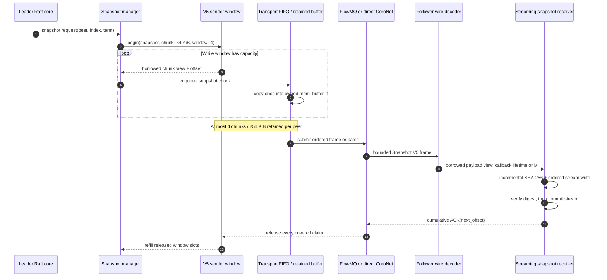

# High-performance Raft replication

## Decision

TurboRaft uses two bounded batching layers without changing the current wire
format:

1. the Raft core may pipeline multiple existing AppendEntries messages per
   peer; and
2. the FlowMQ peer service may submit an already queued peer burst through one
   bounded DEALER owner-context command.

AppendEntries batching is opt-in. Snapshot V5 is separately negotiated and
uses 64 KiB chunks with a four-chunk window; V4 remains the rolling-upgrade
fallback.

The V5 snapshot data path is:



The sender-owned snapshot is the replication fact source. The decoder view is
valid only during its callback; the asynchronous transport queue therefore
owns the single retained copy until submission, rollback, or shutdown. A full
queue returns `TURBO_ENOSPC`, allowing the service to retry from its current
Raft progress without losing ordering.

## Alternatives

- Increasing `TR_RAFT_MAX_APPEND_ENTRIES` was rejected for this phase because
  it changes public structure layout and the fixed v3/v4 wire schema.
- An unbounded asynchronous send queue was rejected because it moves overload
  out of sight and duplicates the existing per-peer queue.
- PUB/SUB was rejected for authoritative replication because it cannot express
  per-follower acknowledgement, rejection, or progress.
- Retaining borrowed network payloads beyond decode remains deferred because it
  would couple Raft entry lifetime to transport-buffer reuse. The measured v3
  receive hot path instead uses a call-scoped generated TBE view and one bounded
  copy into the Raft-owned message.

## Core data protocol

| Property | Contract |
|---|---|
| Data unit | One inflight range: `previous_index`, inclusive `last_index`, and elapsed ticks. |
| Fact source | The Raft log owns entry bytes. `match_index` is the only confirmed peer progress. |
| Ownership | The single-owner core owns every fixed inflight slot. Slots never own entry payloads. |
| Lifetime | A range lives from AppendEntries emission until cumulative success, rejection, timeout, role or membership change, or snapshot completion. |
| Ordering | Ranges are appended and released in increasing log-index order per peer. |
| Capacity | `max_inflight_append_requests`, bounded by `TR_RAFT_MAX_INFLIGHT_APPEND_REQUESTS`. Each request remains bounded by `TR_RAFT_MAX_APPEND_ENTRIES * TR_RAFT_MAX_ENTRY_BYTES`. |
| Backpressure | A full window pauses that peer. It does not allocate, block, drop, or affect another peer. |
| Failure | Rejection or timeout clears speculative ranges, resets `next_index` to a confirmed retry boundary, and enters probe mode. |
| Shutdown | Core destruction needs no drain because inflight slots own no external resources. |
| Observation | Status exposes aggregate inflight count; progress exposes per-peer count, configured limit, probe state, and oldest elapsed ticks. |

The peer progress state is:

```text
PROBE --successful response--> REPLICATE
  ^                              |
  +------ reject / timeout ------+

either state --needs snapshot--> SNAPSHOT
SNAPSHOT --installed-----------> PROBE
```

Only a valid follower response advances `match_index`. Local transport
submission or completion never represents replication or durability.

Successful responses release every contiguous inflight range covered by the
reported `match_index`. A rejection is accepted only when it identifies an
active range; later speculative ranges are invalidated before retry. A success
must identify an active range and report that range's exact last index. Stale
or malformed responses therefore cannot advance confirmed progress.

`tr_raft_core_poll()` may fill available replication-window slots up to the
caller's Ready capacity. If Ready capacity is smaller than the available work,
the remaining work stays derivable from the Raft log and is emitted by a later
poll. This is bounded scheduling, not a second queue.

Time complexity is O(window) for range lookup and cumulative release, where
the window has a hard maximum of 64. Space is O(peers * maximum window), with
fixed storage allocated as part of the core.

## Wire receive data protocol

| Property | Contract |
|---|---|
| Data unit | One complete, envelope-validated v3 Raft payload. |
| Fact source | The caller-owned immutable frame remains authoritative during decode. |
| Ownership | `RaftWireMessageV3_view_t` borrows the frame only for the synchronous decode call; the caller-owned `tr_raft_message_t` owns the result. |
| Lifetime | No view or payload pointer survives `tr_raft_wire_decode()`. Transport-buffer reuse after return is safe. |
| Capacity | Raft payloads are bounded by `TR_RAFT_WIRE_MAX_RAFT_PAYLOAD_SIZE`; entry count is at most 8 and each entry is at most 512 bytes. |
| Failure | Truncated, oversized, trailing, inactive-field, configuration, or semantic errors return `TURBO_EPROTO` before payload copying. |
| Allocation | The v3 receive path performs no dynamic allocation. Each active payload is copied exactly once from the frame into its Raft-owned entry. |

The codec is still created from the generated schema so schema identity remains
validated at initialization. Per-frame decoding uses the generated fixed-offset
getters and bounded variable-data views instead of creating a general-purpose
DataBind owning object. Wire v2 and snapshot decoding retain their compatibility
paths.

## FlowMQ data protocol

| Property | Contract |
|---|---|
| Data unit | One owned payload record in the existing per-peer `TurboDeque`. |
| Fact source | The deque owns unsent payload copies; the Raft log remains the recoverable semantic source. |
| Ownership | Ordinary payloads copy by value. Snapshot enqueue copies borrowed bytes into a retained `mem_buffer_t`; the deque releases it only after submission or shutdown. |
| Scratch lifetime | Service-owned encoded FMQ frames remain valid until the synchronous owner-context command completes and are then released by serialized `step()`. |
| Ordering | Each DEALER preserves its peer FIFO. Batch items use deque order. |
| Capacity | Queue items, batch items, and batch bytes all have validated hard limits. |
| Backpressure | Queue full returns `TURBO_ENOSPC`; disconnection retains unsent ownership. |
| Partial failure | Exactly `submitted` front items are removed. Every remaining item stays queued in its original order. |
| Shutdown | New work is rejected, endpoints stop, connectors join, then scratch and queues are released. |
| Observation | Step results expose frames and batches; status exposes configured batch item/byte limits. |

Batch preparation consumes CoroNet outbound message IDs. A partial FlowMQ
submission may therefore leave unused IDs, which is valid because the receiver
requires strictly increasing IDs rather than contiguous IDs. The unsent queue
suffix is re-encoded on its next submission attempt.

Control handshake frames stay on the synchronous single-message path. Payload
bursts are encoded into bounded FMQ DATA frames and posted once to the DEALER
owner context, which sends the successful FIFO prefix before completing.

## Compatibility and migration

- Raft wire v2/v3 and snapshot V4 bytes do not change; V5 is capability negotiated.
- Existing zero-initialized configs retain a replication window and FlowMQ
  send batch of one.
- Enabling a window greater than one changes the number of messages a Ready may
  expose and requires the caller to continue polling after advancing Ready.
- Enabling a FlowMQ batch requires its outbound capacity to be at least the
  chosen batch item limit.
- Rolling back consists of setting both limits to one; no persisted state or
  wire data requires migration.

## Validation

Correctness tests cover the default single-inflight behavior, window filling,
cumulative acknowledgement, stale responses, rejection rollback, timeout
reset, Ready-capacity limiting, queue saturation, FIFO batch delivery, and
partial-submission ownership.

The deterministic RTT benchmark drives the real core with 257 queued entries.
The first probe carries one entry and the remaining 256 entries require 32
eight-entry AppendRequests. With no loss or rejection, the modeled catch-up
round count is therefore:

```text
round_trips = 1 + ceil(32 / replication_window)
```

| Window | AppendRequests | Round trips | Virtual latency at 20 ms RTT |
|---:|---:|---:|---:|
| 1 | 33 | 33 | 660 ms |
| 4 | 33 | 9 | 180 ms |
| 8 | 33 | 5 | 100 ms |

This is a causal network model, not a wall-clock throughput claim. The wire
benchmarks separately report local encode/decode operations and bytes.
Integration validation keeps TLS/WSS enabled so batch correctness includes the
deployed transport stack.

On the same MSVC Release build and cached 2408-byte frame workload, the v3
decode benchmark changed from 75.735 microseconds / 30.32 MiB/s to a three-run
median of 0.158 microseconds / 14532.64 MiB/s. This approximately 479x codec
microbenchmark improvement demonstrates removal of per-frame reflection and
allocation overhead; it is not a FlowMQ, WSS, storage, or end-to-end network
throughput claim.
